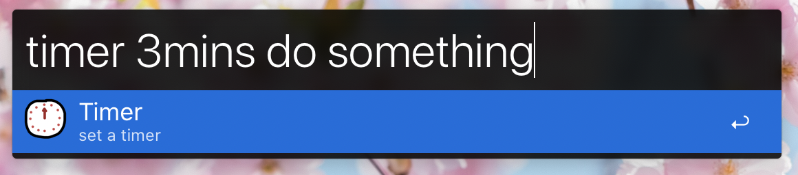

# An Alfred Timer

A simple timer app for [Alfred](https://www.alfredapp.com/).

## Screenshots

<table style="width:100%">
    <tr>
        <td></td>
        <td></td>
    </tr>
</table>

### With a title

<table style="width:100%">
    <tr>
        <td></td>
        <td></td>
    </tr>
</table>

### Invalid input

<table style="width:100%">
    <tr>
        <td></td>
        <td></td>
    </tr>
</table>

## Requirements

Requires Python 3.6+

(If anyone actually wants to use this for themselves _and_ wants it to run on an earlier version of Python - file an issue and I'd be happy to make it backwards compatible.)

## Notes

The timer command accepts a variety of different ways to specify a time unit:

* Seconds: 's', 'sec', 'secs', 'seconds'
* Minutes: 'm', 'min', 'mins', 'minutes'
* Hours: 'h', 'hour', 'hours'

Although (currently), you mustn't leave a gap between the number and the unit:

✅ - "20s", "5minutes", "30mins", "2hours"

❌ - "20 s", "5 mins"
